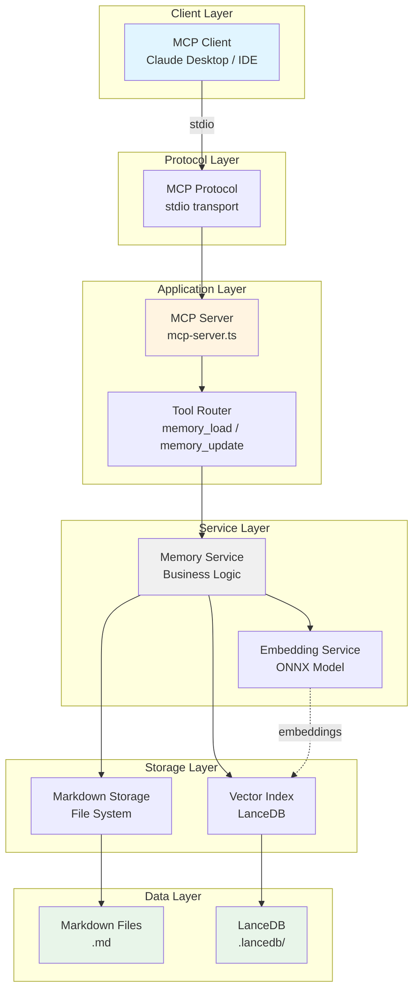
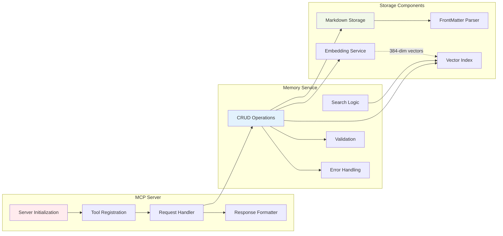
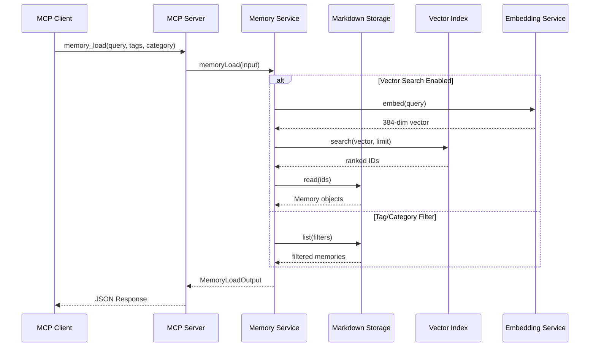
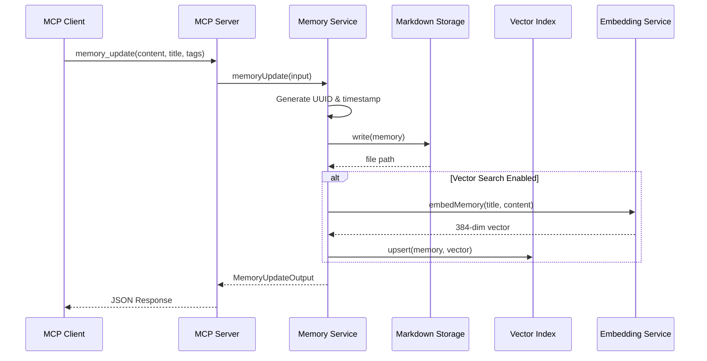
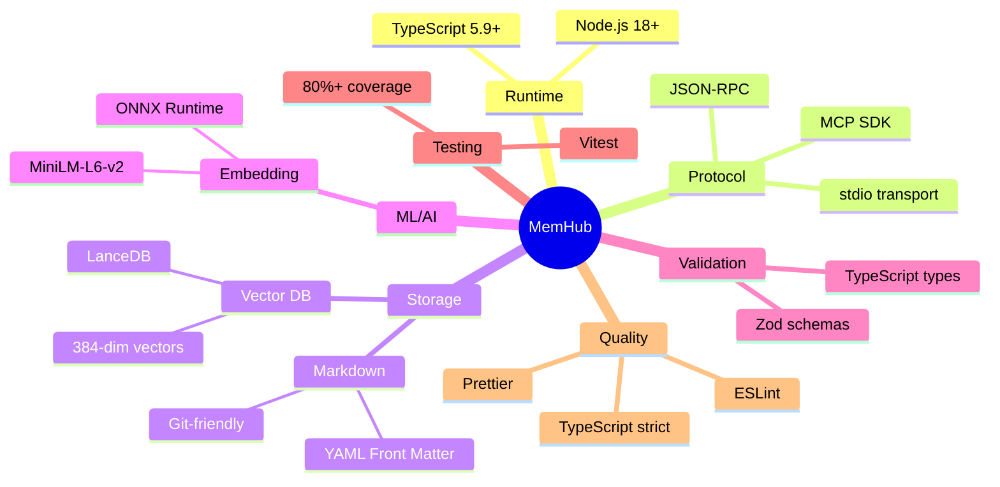
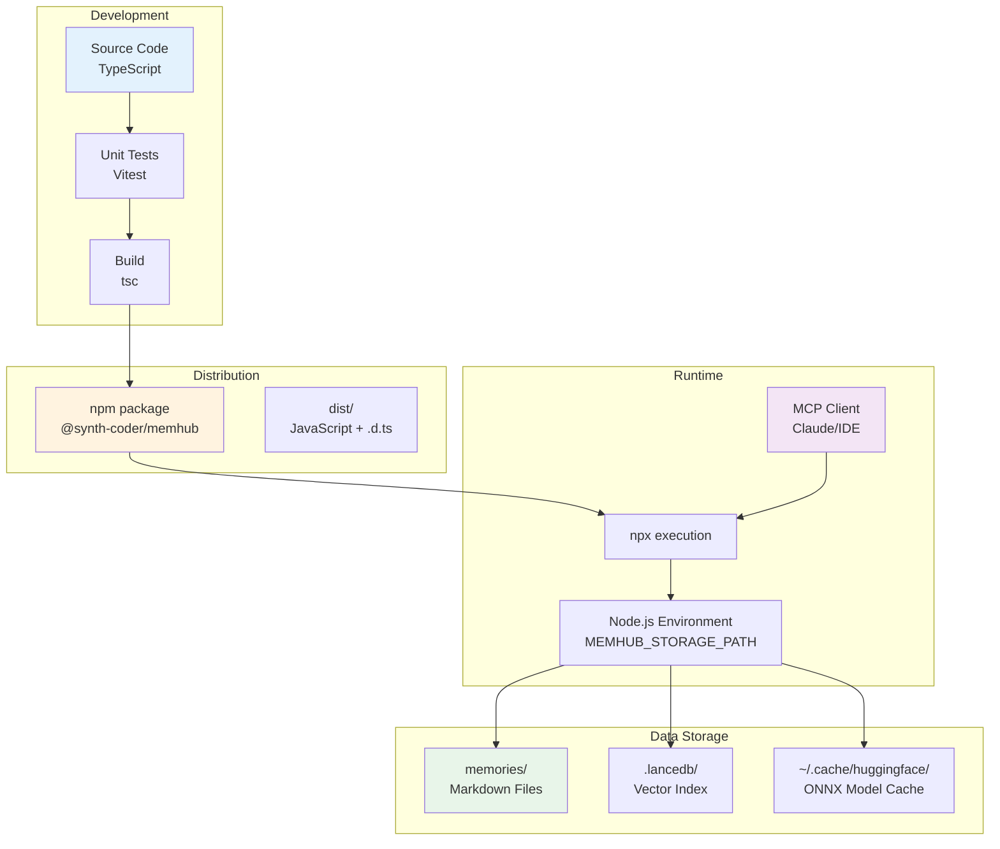
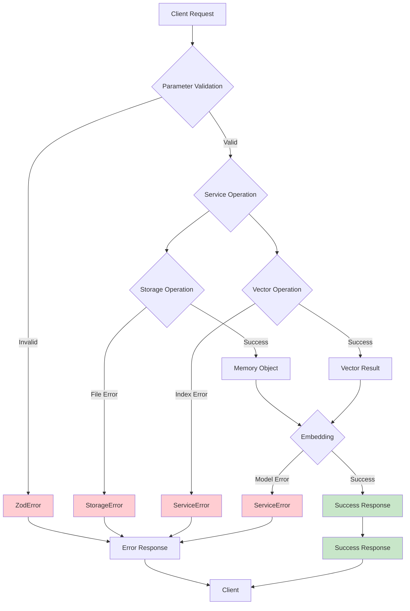
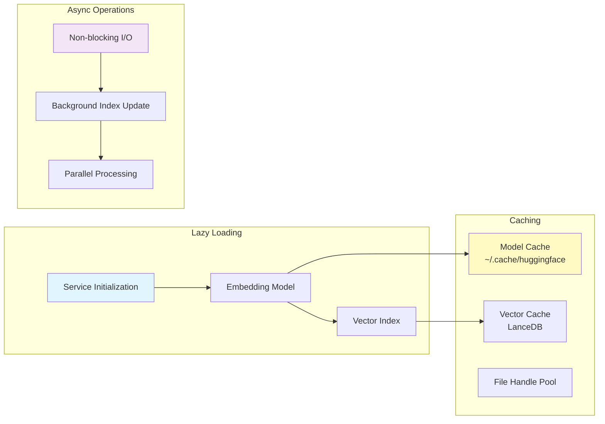

# MemHub 架构图

## 1. 整体系统架构



## 2. 核心组件架构



## 3. 数据流图

### 3.1 Memory Load 流程



### 3.2 Memory Update 流程



## 4. 存储架构

```mermaid
graph TB
    subgraph "File System Structure"
        Root[memories/]
        DateDir[YYYY-MM-DD/]
        SessionDir[session_uuid/]
        File[title-slug.md]
    end

    subgraph "Markdown File Format"
        YAML[YAML Front Matter<br/>---<br/>id: uuid<br/>tags: array<br/>category: string<br/>importance: 1-5<br/>---]
        Content[Markdown Content<br/># Title<br/><br/>Body text...]
    end

    subgraph "Vector Database"
        LanceDB[LanceDB<br/>.lancedb/]
        Table[memories table]
        VectorCol[vector: float32[384]]
        MetaCol[metadata columns<br/>id, title, category, tags]
    end

    Root --> DateDir
    DateDir --> SessionDir
    SessionDir --> File
    File --> YAML
    File --> Content

    LanceDB --> Table
    Table --> VectorCol
    Table --> MetaCol

    style Root fill:#fff9c4
    style LanceDB fill:#e1bee7
```

## 5. 技术栈架构



## 6. 部署架构



## 7. 错误处理架构



## 8. 性能优化架构



## 关键设计特性

### 1. **分层架构**

- **协议层**: MCP 协议处理
- **应用层**: 服务器和路由逻辑
- **服务层**: 核心业务逻辑
- **存储层**: 数据持久化

### 2. **可扩展性**

- 模块化设计，易于添加新的存储后端
- 支持插件式的 embedding 服务
- 可配置的向量搜索开关

### 3. **容错性**

- 优雅的错误处理和降级
- 向量搜索失败不影响基本功能
- Markdown 作为唯一数据源

### 4. **开发体验**

- 完整的 TypeScript 类型支持
- Zod schema 验证
- 详尽的测试覆盖

### 5. **运维友好**

- 纯文本存储，易于备份和迁移
- Git 原生支持版本控制
- 无外部依赖数据库
