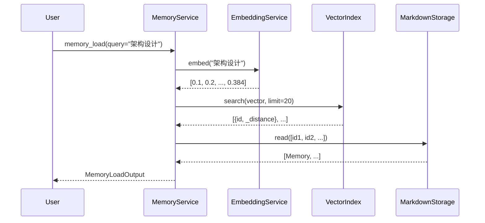

# 向量语义搜索

MemHub 集成了基于向量的语义搜索功能，使用本地 ONNX 模型实现智能记忆检索。

## 概述

### 为什么需要向量搜索？

传统的关键词匹配存在以下限制：

- 无法理解语义相似性（"架构" vs "设计"）
- 无法处理同义词（"偏好" vs "喜好"）
- 无法进行模糊匹配（"React 组件" vs "Component"）

向量语义搜索通过将文本转换为高维向量，计算语义相似度，提供更智能的检索体验。

### 技术实现

- **Embedding 模型**: Xenova/all-MiniLM-L6-v2
- **向量维度**: 384
- **距离度量**: Cosine distance
- **向量数据库**: LanceDB
- **模型缓存**: `~/.cache/huggingface/`

## 架构设计

### 1. 分层架构

```
┌─────────────────────────────────────┐
│     Memory Service (业务层)         │
│  - memoryLoad(query, tags, ...)     │
└──────────────┬──────────────────────┘
               │
       ┌───────┴────────┐
       │                │
┌──────▼─────┐    ┌────▼────────┐
│ Embedding  │    │   Vector    │
│  Service   │    │   Index     │
│ (ONNX)     │    │ (LanceDB)   │
└────────────┘    └─────────────┘
```

### 2. 数据流



## 使用方式

### 1. 基本用法

```typescript
// 语义搜索
const result = await memoryService.memoryLoad({
  query: '如何实现用户认证',
  limit: 10,
});

// 返回语义最相关的记忆
console.log(result.items);
```

### 2. 混合搜索

```typescript
// 语义搜索 + 元数据过滤
const result = await memoryService.memoryLoad({
  query: '数据库优化',
  tags: ['performance', 'backend'],
  category: 'engineering',
  limit: 10,
});
```

### 3. 会话隔离

```typescript
// 限定在特定会话中搜索
const result = await memoryService.memoryLoad({
  query: '项目进度',
  sessionId: '550e8400-e29b-41d4-a716-446655440000',
  scope: 'stm',
});
```

## 配置选项

### 环境变量

```bash
# 启用/禁用向量搜索（默认: true）
MEMHUB_VECTOR_SEARCH=true

# 存储路径（默认: ./memories）
MEMHUB_STORAGE_PATH=/path/to/memories
```

### 禁用向量搜索

在测试环境或资源受限场景下，可以禁用向量搜索：

```bash
MEMHUB_VECTOR_SEARCH=false
```

禁用后：

- `memory_load` 降级为纯元数据过滤
- `memory_update` 不更新向量索引
- 降低内存和磁盘占用

## Embedding 服务

### 模型特性

- **名称**: Xenova/all-MiniLM-L6-v2
- **大小**: ~23MB
- **语言**: 英文为主，支持多语言
- **性能**: 快速推理，适合实时搜索

### 单例模式

```typescript
class EmbeddingService {
  private static instance: EmbeddingService | null = null;

  static getInstance(): EmbeddingService {
    if (!this.instance) {
      this.instance = new EmbeddingService();
    }
    return this.instance;
  }

  async embed(text: string): Promise<number[]> {
    // 返回 384 维归一化向量
  }
}
```

### 懒加载

模型在首次使用时加载：

```typescript
// 构造函数不加载模型
const service = EmbeddingService.getInstance();

// 首次调用 embed() 时加载模型
const vector = await service.embed('some text');

// 后续调用复用已加载的模型
const vector2 = await service.embed('another text');
```

## Vector Index

### LanceDB 特性

- **嵌入式**: 无需独立服务，直接访问文件系统
- **高性能**: 基于 Apache Arrow 列式存储
- **ACID**: 支持事务和并发控制
- **可重建**: 可随时从 Markdown 重建索引

### 索引结构

```sql
CREATE TABLE memories (
  id TEXT PRIMARY KEY,
  vector FLOAT[384],
  title TEXT,
  category TEXT,
  tags TEXT,  -- JSON string
  importance INT,
  createdAt TEXT,
  updatedAt TEXT
);
```

### 搜索算法

1. **向量搜索**: 使用 COSINE 距离
2. **Top-K**: 返回距离最小的 K 个结果
3. **过滤**: 可结合 SQL WHERE 子句

```typescript
// 搜索示例
const results = await table
  .vectorSearch(queryVector)
  .where("category = 'engineering'")
  .limit(10)
  .toArray();
```

## 重建索引

如果向量索引损坏或需要重建：

```typescript
// 1. 删除现有索引
rm -rf memories/.lancedb

// 2. 重新启动服务，索引会在下次写入时自动重建
// 或手动触发重建（TODO: 添加 CLI 命令）
```

## 性能优化

### 1. 模型缓存

模型下载后缓存在 `~/.cache/huggingface/`，避免重复下载。

### 2. 向量缓存

LanceDB 自动缓存热门向量，提升搜索速度。

### 3. 批量处理

对于大量记忆条目，建议批量更新：

```typescript
// TODO: 添加批量更新接口
await memoryService.batchUpdate(memories);
```

### 4. 异步更新

向量索引更新在后台异步执行，不阻塞主流程：

```typescript
// Markdown 写入完成立即返回
// 向量索引在后台更新
await memoryService.memoryUpdate(input);
```

## 错误处理

### 降级策略

```typescript
try {
  // 尝试向量搜索
  const results = await vectorIndex.search(vector, limit);
} catch (error) {
  // 降级为文本搜索
  console.warn('Vector search failed, falling back to text search');
  const results = await markdownStorage.search(query, limit);
}
```

### 日志记录

```typescript
// 成功
console.log('Vector search completed', { query, results: results.length });

// 失败
console.error('Vector search failed', { error: error.message });
```

## 限制与注意事项

### 1. 语言支持

当前模型主要针对英文优化，中文效果可能不如英文。

### 2. 模型大小

模型约 23MB，首次使用时需要下载。

### 3. 内存占用

ONNX Runtime 需要额外内存（约 100-200MB）。

### 4. 向量维度

固定 384 维，无法更改。

## 未来规划

- [ ] 支持多语言模型（中文优化）
- [ ] 添加模型管理 CLI 命令
- [ ] 支持自定义 embedding 模型
- [ ] 添加索引健康检查
- [ ] 支持向量维度配置
- [ ] 优化大批量索引构建

## 参考资料

- [LanceDB 文档](https://lancedb.github.io/lancedb/)
- [Xenova Transformers](https://github.com/xenova/transformers.js)
- [all-MiniLM-L6-v2 模型](https://huggingface.co/sentence-transformers/all-MiniLM-L6-v2)
